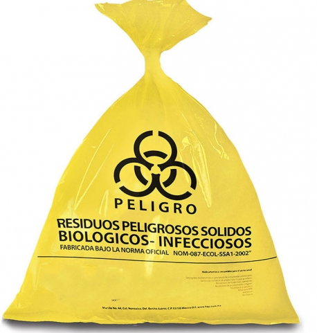

================================================
Residuos Peligrosos Biológico-Infecciosos (RPBI)
================================================

**********
definicion
**********

son desechos que contienen agentes biológicos, como bacterias, virus u otros
microorganismos patógenos, que pueden causar enfermedades en los seres humanos
o el medio ambiente si no se gestionan y eliminan de manera adecuada

Estos residuos suelen generarse en entornos médicos, laboratorios de
investigación, instalaciones de tratamiento de desechos médicos y otros lugares
donde hay riesgo de contaminación biológica

***************
caracteristicas
***************

Potencial de contagio:
Los RPBI pueden contener agentes biológicos infecciosos, como bacterias, virus,
hongos y parásitos, que tienen la capacidad de causar enfermedades en humanos u
otros organismos vivos si se exponen a ellos.

Generación en entornos específicos:
Los RPBI suelen generarse en entornos de atención médica, laboratorios de
investigación, instalaciones de tratamiento de desechos médicos, hospitales,
consultorios médicos y centros de atención de pacientes.

Riesgo para la salud pública:
Su incorrecta gestión de los RPBI puede representar un riesgo para la salud
pública al propagar enfermedades infecciosas. 

Clasificación:
Los RPBI se clasifican en categorías según su nivel de peligrosidad

Envases específicos:
Los RPBI deben ser almacenados y transportados en contenedores adecuados,
como bolsas rojas o amarillas

Etiquetado y señalización:
Los envases de RPBI deben estar claramente etiquetados y señalizados para
indicar su contenido peligroso.

Tratamiento especializado:
Los RPBI a menudo requieren métodos de tratamiento especializados, como la
autoclave, incineración controlada o desinfección química.

Personal capacitado:
La manipulación, transporte y eliminación debe ser realizada por
personal capacitado y certificado

version corta
=============

los RPBI son desechos que contienen
agentes infecciosos y representan un riesgo potencial para la salud pública y
el medio ambiente si no se gestionan de manera adecuada y segura. Su correcto
manejo es esencial para prevenir la propagación de enfermedades y garantizar la
seguridad de quienes trabajan con ellos y de la comunidad en general.

********
ejemplos
********

* Sangre y sus componentes sólo en su forma líquida
	* Derivados no comerciales incluyendo células progenitoras, hematopoyéticas.
	* Fracciones celulares o acelulares de la sangre (hemoderivados).
* Cultivos y cepas de agentes Biológico-Infecciosos
	* Los cultivos generados en:
		* Los procedimientos de diagnóstico e investigación.
		* Producción y control de agentes biológico- infecciosos.
	* Utensilios desechables utilizados para:
		* Contener, transferir, inocular y mezclar agentes biológico-infecciosos.
* Patológicos
	* Tejidos y órganos y partes que remueven o extirpan en necropsias,
	  cirugías y que no se encuentren en formol.
	* Muestras biológicas para análisis químico, microbiológico e histológico, excluyendo orina y excremento.
	* Cadáveres y partes de animales inoculados con agentes enteropatógenos
	  en centros de investigación y bioterios
* Residuos no anatómicos
	* Recipientes desechables que contengan sangre líquida.
	* Materiales de curación empapados, saturados o goteando sangre
	  o cualquiera de los siguientes fluidos corporales:
	* Líquido sinovial, pericárdico, pleural, céfalo-raquídeo, peritoneal.
	* Material desechable que contengan esputo, secreciones pulmonares
	  y cualquier material usado para contener éstos de pacientes
	  con sospecha o diagnóstico de tuberculosis
	  o de otra enfermedad infecciosa.
	* Materiales desechables empapados, saturados o goteando sangres,
	  o secreciones de pacientes con sospecha
	  o diagnóstico de fiebres hemorrágicas,
	  así como enfermedades infecciosas emergentes.
	* Materiales absorbentes utilizados en jaulas de animales que hayan sido expuestos a agentes enteropatógenos.
* Objetos punzocortantes
	* Incluye:
		tubos capilares, navajas, lancetas, agujas de jeringas desechables,
		agujas hipodérmicas, de sutura, de acupuntura, de tatuaje, bisturí
		y estiletes de catéter.
		Siempre que hayan estado en contacto con humanos
		o animales o sus muestras biológicas durante
		el diagnóstico y tratamiento.
	Excluye: todo material de vidrio roto utilizado en el laboratorio,
	el cual deberá ser desinfectado o esterilizado antes de ser dispuesto
	como residuo de manejo especial.

****
usos
****

no tiene usos especificos al ser desechos

******
manejo
******

Paso 1. Identificación de los residuos
======================================

los desechos deben ser identificdos inmediatamente en el procedimiento que los
genero y en el sitio, para evitar una reclasificacion de los desechos

la identificacion de los desechos y envasado se separan los residuos segun su
estado siquido o solido y su tipo

	* Objetos punzocortantes
	* Residuos no anatómicos
	* Patológicos
	* Sangre líquida y sus derivados
	* Utensilios desechables utilizados para contener, transferir, inocular y mezclar cultivos

Paso 2. Envasado de los residuos generados
==========================================

Una vez que los residuos han sido identificados y separados de acuerdo al tipo
y estado físico, estos deberán ser envasados de acuerdo a la tabla siguiente.
La razón para usar diferentes recipientes para diferentes RPBI es porque
distintos residuos tienen diferentes procesos en su disposición final

punzo cortante:
contenedor rigido de polipropileno

.. image:: e.2/conenedor_punzo_cortante_rojo.jpg
  :width: 200

no anatomico y materiales desechables:
Bolsas de plástico roja

.. image:: e.2/bolsa_polietileno_roja.jpg
  :width: 200

Patológicos
Bolsas de plástico amarilla

Sangre líquida y sus derivados, Fluidos corporales
Contenedor hermetico rojo
Bolsas de plástico amarilla

.. image:: e.2/recipiente_hermetico_rojo.webp
  :width: 200

Muestras para análisis de laboratorio **excluyendo orina y excremento**

.. image:: e.2/contenedor_hermetico_amarillo.jpg
  :width: 200

Paso 3. Almacenamiento temporal
===============================

Los RPBI deberán almacenarse en contenedores con tapa y permanecer cerrados
todo el tiempo. No debe de haber residuos tirados en los alrededores de los
contenedores.

Paso 4. Recolección y transporte externo
========================================

1. Los distintos tipos de residuos que se generan en la zona de recolecion
2. Conocer los diferentes envases para cada tipo de residuo.
3. El manejo para cada tipo de residuo.
4. El equipo de protección que debe usar.
5. El procedimiento para su recolección

nota de los conenedores a recolectar:
	1. La recolección deberá realizarse una o dos veces al día o cuando estén al 80% de su capacidad.
	2. Las bolsas de recolección no deben de llenarse más de un 80%. (envasado)
	3. No se deben de comprimir las bolsas.  (envasado)
	4. Cerrar las bolsas con un mecanismo de amarre seguro que evite que los residuos salgan (nudo o cinta adhesiva).
	5. Verificar que los contenedores estén bien cerrados.
	6. La basura común se colocará en botes o bolsas de plástico de cualquier color excepto roja o amarilla.

Paso 5. Tratamiento
===================

se puede usar un autoclave, excepto para punzocortantes y partes de cuerpo
el autoclave para el tratamiento de RPBI no puede ser utilizado para otros
instrumentos, por lo que se recomineda ubicar el autoclave en un sitio especial
solo para el tratamiento de RPBI

Paso 6. Disposición final
=========================

Los RPBI que hayan sido tratados podrán disponerse en los camiones recolectores
de basura común, mientras que los RPBI sin tratamiento deberán enviarse a
empresas recolectoras autorizadas.

============
señalizacion
============

señalizacion de peligro biologico

ANSI Z535 / ISO 3864 / ISO 7010

ISO W009

Unicode: U 2623 ( ☣ ).

.. image:: e.2/biohazzar_ISO_7010_W009.svg.png
  :width: 200

************
bibliografia
************

NOM-087-SEMARNAT-SSA1-2002

https://www.pediatria.gob.mx/archivos/burbuja/10_Guia_manejo_RPBI.pdf
