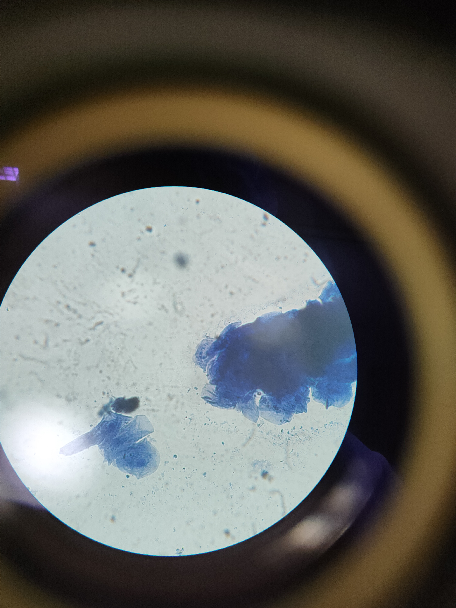
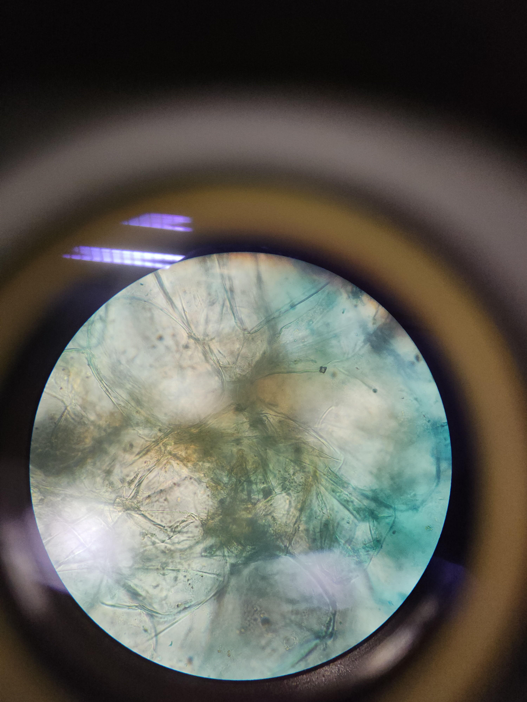

***********************************************
Observacion de celulas procariotas y eucariotas
***********************************************

Celila epitelia
===============

Objetivo: observacion de celulas de piel

muestra:
	*Celila epitelia*

metodologia:

	1. se optione la muestra usando un depresor lingual con un raspado continuo en interior de la mejilla de la boca
	2. se hace un frotis de en un porta objetos
	3. se tiña con azul de metileno
	4. se colaca el cubre objetos
	5. se hace la observacion de la muestra con el microscopio con 40x de aumento

muestras
--------

.. image:: unsort_img/IMG20231215112304.jpg
	:width: 200
.. image:: unsort_img/IMG20231215112308.jpg
	:width: 200
.. image:: unsort_img/IMG20231215112321.jpg
	:width: 200
.. image:: unsort_img/IMG20231215112323.jpg
	:width: 200
.. image:: unsort_img/IMG20231215112328.jpg
	:width: 200
.. image:: unsort_img/IMG20231215112348.jpg
	:width: 200

.. image:: unsort_img/IMG20231215112536.jpg
	:width: 200

observaciones
-------------

en esta muestra se pueden observar algunas estructuras celulares
particularmente su nucleo

Ejote
=====

Objetivo: observacion de celulas de piel

muestra:
	*Phaseolus vulgaris in situ*

metodologia:

	1. se obtiene la muestra de una celula vegetal con un corte fino de un ejote
	2. se coloca la muestra en un portaobjetos
	3. se agrega agua destilada
	4. se colaca el cubre objetos
	5. se hace la observacion de la muestra con el microscopio con 40x de aumento
	6. se hace la observacion de la muestra con el microscopio con 100x de aumento

muestras
--------

40x
^^^

.. image:: unsort_img/IMG20231215114948.jpg
	:width: 200
.. image:: unsort_img/IMG20231215120437.jpg
	:width: 200
.. image:: unsort_img/IMG20231215120452.jpg
	:width: 200
.. image:: other/cloroplastos.jpeg
	:width: 200

100x
^^^^

.. image:: unsort_img/IMG20231215122429.jpg
	:width: 200

observaciones
-------------

en la muestra usando el objetivo de 40x se puede observar los cloroplastos
se encuentran cercas de la pared celular con

.. image:: p3/cloroplastos_40x.png

en la muestra usnado el objetivo de 100x se puede distinguir los cloroplastos
de manera individual pero sin poder observar su estructura interna

.. image:: p3/cloroplastos_100x.png

platano
=======

Objetivo: observar aminoplastos en celulas vegetales de un platano

muestra:
	*Musa paradisiaca L.*

metodologia:

	1. se obtiene la muestra de un platano y se coloca en un porta objetos
	2. se agrega yodo lugol a la muestra
	3. se colaca el cubre objetos
	4. se hace la observacion de la muestra con el microscopio con 40x de aumento

muestras
--------

40x
^^^

.. image:: p3/platano.jpeg
	:width: 200

observaciones
-------------

en la muestra usando el objetivo de 40x se puede observar los aminoplastos

.. image:: p3/platano.jpeg

manzana
=======

Objetivo: observar las celas de una manzana

muestra:
	*Malus domestica*

metodologia:

	1. se obtiene la muestra de un manzana en un porta objetos
	2. se agrega agua destilada con azul de metileno
	3. se colaca el cubre objetos
	4. se hace la observacion de la muestra con el microscopio con 40x de aumento

muestras
--------

40x
^^^

.. image:: other/48.jpeg
	:width: 200
.. image:: unsort_img/IMG20231215124117.jpg
	:width: 200

.. image:: unsort_img/IMG20231215124143.jpg
	:width: 200

observaciones
-------------

en la muestra usando el objetivo de 40x se pueden observar algunos organelos
de la celula

.. image:: other/48.jpeg

sangre
======

Objetivo: observar una muestra de sangre con solucion hipotonica

muestra:
	sangre de *Homo sapiens sapiens*

metodologia:

	1. se obtine una muestra de sangre usando un alfiler esterilizado
	2. se coloca la muestra en un porta objetos
	3. se agrega la solucion hipotonica
	4. se coloca el cubreobjetos
	4. se hace la observacion de la muestra con el microscopio con 40x de aumento

muestras
--------

40x
^^^

.. image:: otros_2/sangre_2.jpeg
	:width: 200

observaciones
-------------

en la muestra usando el objetivo de 40x como las celulas se inflaman a causa
del ambiente hipotonico

.. image:: otros_2/sangre_2.jpeg

manzana
=======

Objetivo: observar las celas de una manzana

muestra:
	*Malus domestica*

metodologia:

	1. se obtiene la muestra de un manzana en un porta objetos
	2. se agrega agua destilada con azul de metileno
	3. se colaca el cubre objetos
	4. se hace la observacion de la muestra con el microscopio con 40x de aumento

muestras
--------

40x
^^^

.. image:: other/48.jpeg
	:width: 200
.. image:: unsort_img/IMG20231215124117.jpg
	:width: 200

.. image:: unsort_img/IMG20231215124143.jpg
	:width: 200

observaciones
-------------

en la muestra usando el objetivo de 40x se pueden observar algunos organelos
de la celula

.. image:: other/48.jpeg

hipertonica
===========

Objetivo: observar una muestra de una planta en solucion hipertonica

metodologia:

	1. se obtiene una muestra de una planta con un corte fino
	2. se coloca la muestra en un porta objetos
	3. se agrega la solucion hipertonica
	4. se coloca el cubreobjetos
	4. se hace la observacion de la muestra con el microscopio con 40x de aumento

muestras
--------

40x
^^^

.. image:: other/3.jpeg
	:width: 200

.. image:: other/4.jpeg
	:width: 200

observaciones
-------------

en la muestra usando el objetivo de 40x se puede observar el movimiento de la
vacuola a causa del marchitamiento de la celula por la perdida de presion de turgencia

.. image:: other/4.jpeg

fungi
=====

Objetivo: observar una muestra de una planta en solucion hipertonica

metodologia:

	1. se obtiene una muestra de una planta con un corte fino
	2. se coloca la muestra en un porta objetos
	3. se agrega la solucion hipertonica
	4. se coloca el cubreobjetos
	4. se hace la observacion de la muestra con el microscopio con 40x de aumento

muestras
--------

40x
^^^

.. image:: other/3.jpeg
	:width: 200

.. image:: other/4.jpeg
	:width: 200

observaciones
-------------

en la muestra usando el objetivo de 40x se puede observar el movimiento de la
vacuola a causa del marchitamiento de la celula por la perdida de presion de turgencia

.. image:: other/4.jpeg
