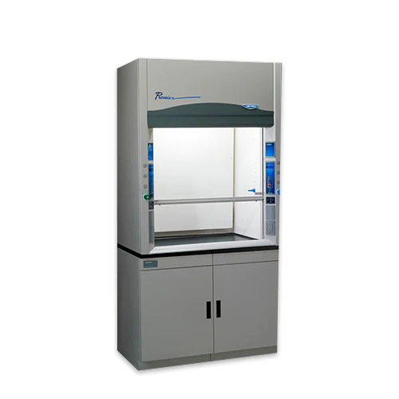
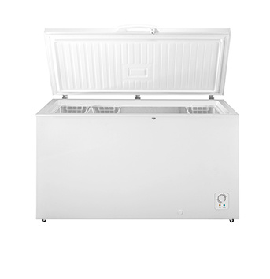
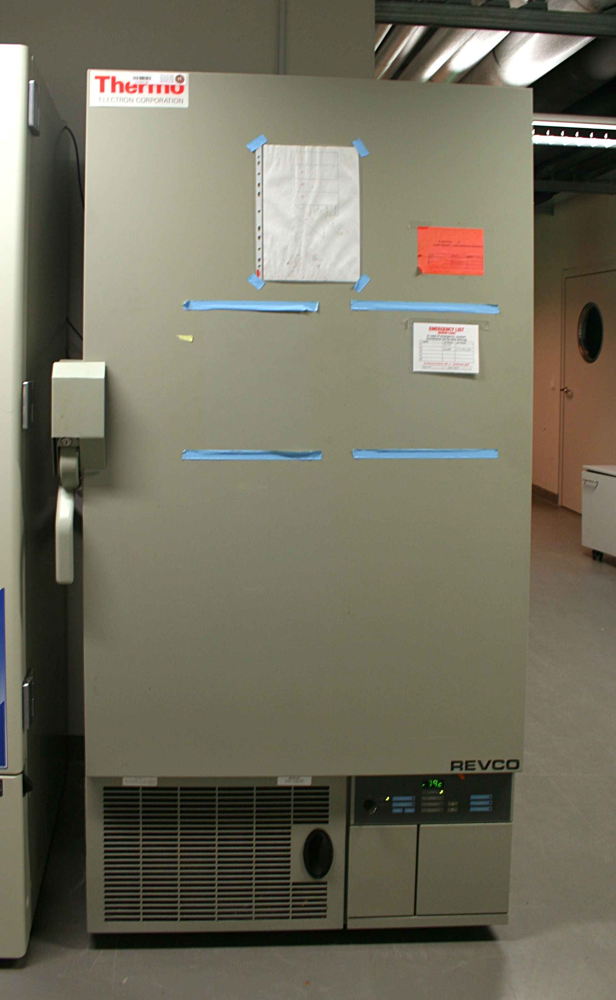

=================================
catalogo de equipo de laboratorio
=================================

**********************************
Campana de extracción de solventes
**********************************

generalmente es rectangular como un gabinete o caja con una abertura frontal
que puede abrirse o cerrarse, el interior esta hecho de materiales resistentes
a productos quimicos y tiene una superficie de trabajo en su interior

en la parte superior de a campana tiene un sistema de ventilacion que incluye
un extractor o ventilador que aspira los vapores del interior de la caja hacia
arriba y luego hacia fuera de la campana a travez de un sistema de ventiacion
con un sistema filtracion o se expulsan al exterior del edificio

tiene controles para regular el flujo de aire e iluminacion para la mesa
de trabajo

breve
=====

extrae vapores usando un extractor junto a un sistema de filtracion o
los expulsa al exterior, tiene forma de caja con una apertura y una mesa
trabajo en el interior

es una caja con una apertura y una mesa de trabajo en su interior
extrae vapores usando un extractor junto a sistema de filtracion

.. image:: catalogo_equipo_lab/campana_extracion_1.webp
  :width: 200

************
refrigerador
************

Un refrigerador de laboratorio es un equipo que se utiliza para mantener
productos químicos y muestras a temperaturas controladas en un entorno de
laboratorio. Se asemeja a un refrigerador doméstico, pero está diseñado
para condiciones de laboratorio y puede ajustarse a rangos de temperatura
específicos. Esto ayuda a preservar la integridad de los materiales
almacenados.

breve
=====

mantiene productos quimicos y muestras a temperaturas controladas
ayuda a preserva la integridad de los materiales

.. image:: catalogo_equipo_lab/refrigerador_1.jpg
  :width: 200

**********
congelador
**********

Un congelador de laboratorio es un equipo diseñado para mantener muestras
y productos químicos a temperaturas muy bajas, generalmente entre -20°C y
-80°C, garantizando su almacenamiento seguro y a largo plazo en entornos de
investigación y laboratorios.

breve
=====

mantiene muestras y productos quimicos a temperaturas bajas, entre -20°C y
-80°C

.. image:: catalogo_equipo_lab/congelador_3.webp
  :width: 200

***************
ultracongelador
***************

Un ultracongelador es un dispositivo de laboratorio que puede alcanzar
temperaturas extremadamente bajas, típicamente alrededor de -80°C o más frías,
para el almacenamiento a largo plazo de muestras biológicas y materiales
sensibles a la temperatura.

breve
=====

mantiene muestras y productos quimicos a temperaturas extremadamente bajas
alrededor de -80°C o mas frias para el almacenamiento a largo plazo

