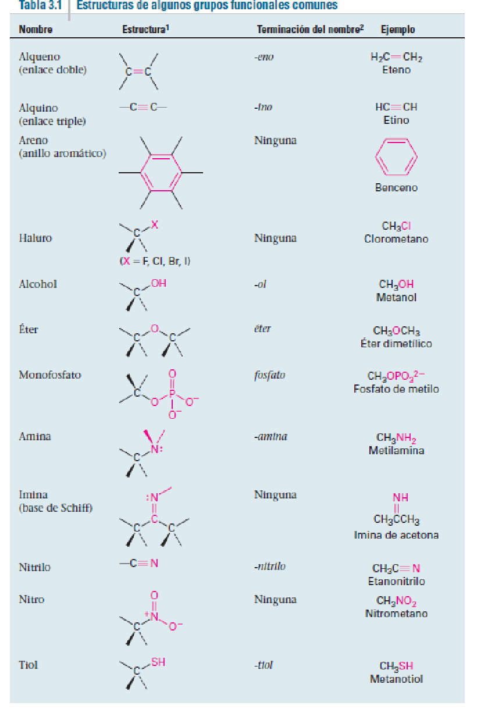
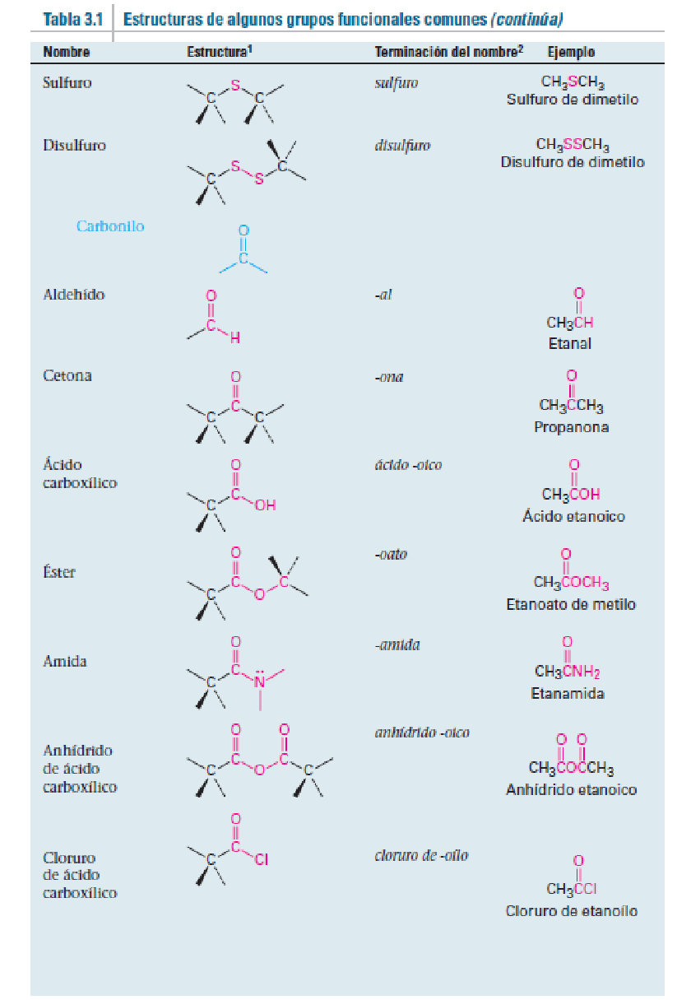

*******
tarea 1
*******

Proponga estructuras que concuerden con las siguientes descripciones:
	a. Dos ésteres isoméricos con la fórmula C5 H10 O2

	.. math::
		\chemfig{CH_3-[1]C([2]=O)-[7]O-[1]CH_2-[7]CH_2-[1]CH_3}

	.. math::
		\chemfig{CH_3-[1]CH_2-[7]O-[1]C([2]=O)-[7]CH_3}

	b. Dos nitrilos isoméricos con la fórmula C4 H7 N

	.. math::
		\chemfig{H~C-[1]CH_2-[7]CH_2-[1]CH_3}

	.. math::
		\chemfig{H~C-[1]CH(-[2]CH_3)-[7]CH_3}

	c. Dos disulfuros isoméricos con la fórmula C4 H10 S2

	.. math::
		\chemfig{CH_3-[7]CH_2-[1]S-[7]S-[1]CH_2-[7]CH_3}

	.. math::
		\chemfig{CH_3-[1]S-[7]S-[1]CH_2-[7]CH_2-[1]CH_3}

¿Cuántos isómeros hay con las siguientes descripciones?
	a. Alcoholes con la fórmula C3 H8 O
		2 isomeros

	.. math::
		\chemfig{OH-C-C-C}

	.. math::
		\chemfig{OH-C(-[2]C)-C}

	b. Bromoalcanos con la fórmula C4 H9 Br
		3 isomeros

	.. math::
		\chemfig{Br-C-C-C-C}

	.. math::
		\chemfig{Br-C-C(-[2]C)-C}

	.. math::
		\chemfig{Br-C(-[2]C)(-[6]C)-C}

Nota:
	Se anexa tabla de grupos funcionales para que se ayuden.

