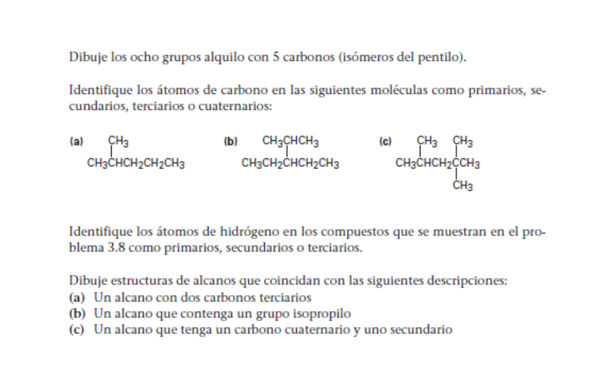

*******
tarea 2
*******

1. dibuje los ocho grupos alquilo con 5 carbonos ( isomeros pentilo ).
	.. math::
		\chemfig{ CH_3 -[1]CH_2 -[7]CH_2 -[1]CH_2 -[7]CH_3 }

	.. math::
		\chemfig{ CH_3 -[1]CH_2 -[7]CH (-[6]CH_3) -[1]CH_3 }

	.. math::
		\chemfig{ CH_3 -[1]CH (-[6]CH_3) -[7]CH_2  -[1]CH_3 }

	.. math::
		\chemfig{ CH_3 -CH (-[2]CH_2 -CH_3) -CH_3 }

	.. math::
		\chemfig{ CH_3 -CH (-[2]CH_3 ) (-[6]CH_3) -CH_3 }

2. identifique los atomos de carbono en las sigueintes moleculas ocmo primarios
secundarios, terciarios o cuaternarios

	.. math::
		\chemfig{
		CH_3 (-[6]{primario})
		-{\color{red}C}H (-[7]{terciario})
		(-[2]CH_3 (-[4]{primario}))
		-CH_2 ( -[2]-[2]{secundario} )
		-CH_2 ( -[2]{secundario} )
		-CH_3 ( -[6]{primario}) }

	.. math::
		\chemfig{
			CH_3 ( -[6]{primario} )
			-CH_2 ( -[6]-[6]{secundario} )
			-CH ( -[5]{terciario} )
			(
				-[2]CH ( -[2]{terciario} )
				( -[4]CH_3 ( -[3]{primario} ) )
				-CH_3 ( -[1]{primario} )
			)
			-CH_2 ( -[6]{secundario} )
			-CH_3 ( -[7]{primario} ) }

	.. math::
		\chemfig{
			CH_3 ( -[5]{primario} )
			-CH ( -[5]{terciario} )
			( -[2]CH_3 ( -[2]{primario} ) )
			-CH_2 ( -[6]{secundario} )
			-C ( -[1]{cuaternario} )
			( -[2]CH_3 ( -[2]{primario} ) )
			( -[6]CH_3 ( -[7]{primario} ) )
			-CH_3 ( -[7]{primario} )
		}

3. identifique los atomos de hidrogeno en los compuestos que se muestran en el
problema 3.8

	.. math::
		\chemfig{
		CH_3 (-[6]{cuaternario})
		-{\color{red}C}H (-[7]{secundario})
		(-[2]CH_3 (-[4]{cuaternario}))
		-CH_2 ( -[2]-[2]{terciario} )
		-CH_2 ( -[2]{terciario} )
		-CH_3 ( -[6]{cuaternario}) }

	.. math::
		\chemfig{
			CH_3 ( -[4]{cuaternario} )
			-CH_2 ( -[5]-[6]{terciario} )
			-CH ( -[5]{secundario} )
			(
				-[2]CH ( -[2]{secundario} )
				( -[4]CH_3 ( -[3]{cuaternario} ) )
				-CH_3 ( -[1]{cuaternario} )
			)
			-CH_2 ( -[6]{terciario} )
			-CH_3 ( -[7]{cuaternario} ) }

	.. math::
		\chemfig{
			CH_3 ( -[5]{cuaternario} )
			-CH ( -[6]-[6]{secundario} )
			( -[2]CH_3 ( -[2]{cuaternario} ) )
			-CH_2 ( -[6]{terciario} )
			-CH ( -[1]{primario} )
			( -[2]CH_3 ( -[2]{cuaternario} ) )
			( -[6]CH_3 ( -[7]{cuaternario} ) )
			-CH_3 ( -[7]{cuaternario} )
		}

4. dibuje estructuras de alcanos que coincidan con las siguientes descripciones
	a. un alcano con dos carbonos terciarios
		.. math::
			\chemfig{
				CH_3 -CH (-[2]CH_3 )
				-CH_2
				-CH ( -[6]CH_3 )
				-CH_3
			}
		
	b. un alcano que contenga un grupo isopropilo
		.. math::
			\chemfig{
				CH_3 -CH_2 -CH_2
				( -[2]CH_2 ( -[3]CH_3 ) (-[1]CH_3 ) )
				-CH_2 -CH_2
				( - CH_3 )
			}
	c. un alcano que tenga un carbono cuaternario y uno secundario

		.. math::
			\chemfig{
				CH_3 -CH (-[2]CH_3 )
				-CH_2
				-C ( -[6]CH_3 )
				( -[2]CH_3 )
				-CH_3
			}
